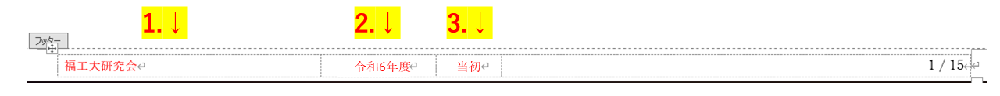
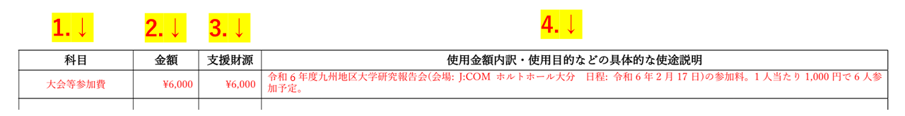
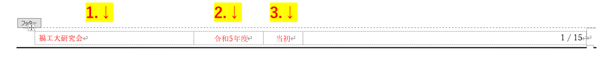

[書類の説明に戻る](./書類の説明.md)
# 使途別金額明細書(様式3) 説明

## この書類は？
年間収支額及び支援希望額表で表記した勘定科目別金額を使途ごとに分けて記入します。
例えば、消耗品費の合計が10,000円であった場合、合計額を記述するのが「年間収支額及び支援希望額表」で、買う物ごとに分けて記述するのが「使途別金額明細書」です。

## 提出

- **様式**  
[使途別金額明細書-テンプレート.docx]()(ダウンロードリンク)  

- **提出条件**  
提出必須  

- **ファイルの種類**  
docx(Wordファイル)  

- **ファイル名**  
使途別金額明細書-<ins>団体名</ins>.docx  
団体名の部分を編集してください。  
(例: 使途別金額明細書-福工大研究会.docx)  

## 記入例
[こちら](./sample/使途別金額明細書-記入例.pdf)から参照できます。赤字部分が記入箇所です。  
以下の説明と同時に閲覧することをおすすめします。

## 記入項目
3つのブロックに分かれています。
- [基本情報](#基本情報)
- [使途別金額明細表](#使途別金額明細表)
- [フッター](#フッター)

*****

### 基本情報
6つの記入項目があります。

1. **申請日**  
申請をする日付を記入します。クリックするとカレンダーが表示されるので、日付を選択してください。

2. **年度**  
申請をする年度を記入します。
<string><ins>和暦</ins></string>で記入してください。  

3. **申請区分**  
申請する区分を記入します。**当初を選択してください。** クリックするとプルダウンメニューが表示されますので、該当する項目を選択してください。 

4. **所属**  
「体育会」か「学術文化会」のいずれか所属している方を選びます。クリックするとプルダウンメニューが表示されますので、該当する項目を選択してください。

5. **団体格**  
団体の格を記入します。クリックするとプルダウンメニューが表示されますので、該当する項目を選択してください。

6. **団体名**  
団体の名称を記入します。正式名称で記入してください。

*****

### 使途別金額明細表
記入項目は3つあります。

1. **科目**  
出入金する件の勘定科目を記入します。勘定科目の説明は[こちら](./勘定科目表.md)にあります。  
クリックするとプルダウンメニューが表示されますので、該当する項目を選択してください。

2. **金額**  
出入金金額を記入します。

2. **支援財源**  
項目2に記入した金額のうち、支援財源(活動支援金)で出入金する金額を記入します。  
例えば、画像では大会等参加費の全額を支援財源で出金しています。

4. **使用金額内訳・使用目的などの具体的な使途説明**  
出入金する件の、内訳や使用目的、使途の説明を記入します。  
**5W2H**: 「When（いつ）」「Where（どこで）」「Who（だれが）」「What（なにを）」「Why（なぜ）」「How（どのように）」「How Much（いくらで）」**を意識して記入してください。**  
記入する出入金によっては5W2Hの何個かが書けない場合がありますが、その際は記述する必要はありません。    
また、必ず根拠となる資料(予約ページや見積書など)を追加資料として作成し、この欄に資料番号を書いてください。  
pdfの記入例では他の例もありますので参考にしてください。

**注意点**
- 1科目で1行ではなく、出入金1件に対して1行の記入です。  
この書類は、科目ごとの出入金の概要を記入することが目的ではありません。必ず1件ごと記入してください。  
- **全ての出入金が対象です。**  
独自財源(活動支援金以外の金銭)のみの出入金も記入してください。
- **1行あたりの高さに制限はありません。**  
説明欄をできるだけ充実させてください。曖昧な場合は活動支援金での支援が難しくなります。また、これらの予算書は、活動を行う上で必要な金額を見積もり、財務管理を行う習慣をつけることを目的に導入しております。この目的の達成も目指してください。
- 記入欄が不足した時は自分でコピーしてください。
- **記入欄が余った時は削除してください。**  
削除する行を選択して、タブの「レイアウト」、「行と列」の削除を開き、「行の削除」を選択してください。

*****

### フッター
3つの記入項目があります。編集は、フッター上でダブルクリックするとできるようになります。
1. **団体名**  
団体の名称を記入します。正式名称で記入してください。

2. **年度**  
申請をする年度を記入します。**<ins>和暦</ins>**で記入してください。  

3. **申請種別**  
申請する期間区分を記入します。**当初を選択してください。** クリックするとプルダウンメニューが表示されますので、該当する項目を選択してください。 

## 戻る
[上に戻る](#使途別金額明細書様式3-説明)  
[書類の説明に戻る](./書類の説明.md)  