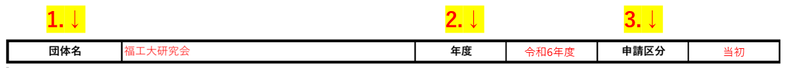
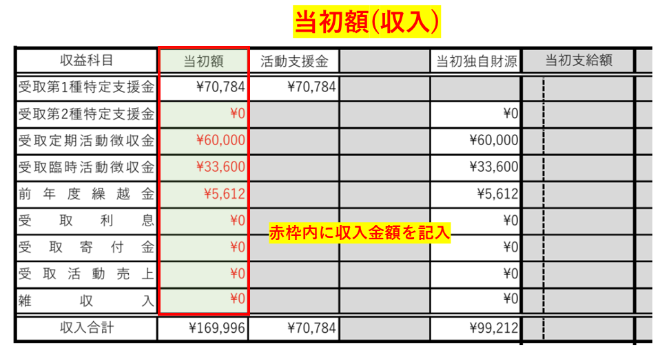
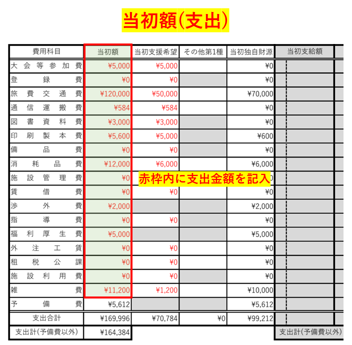
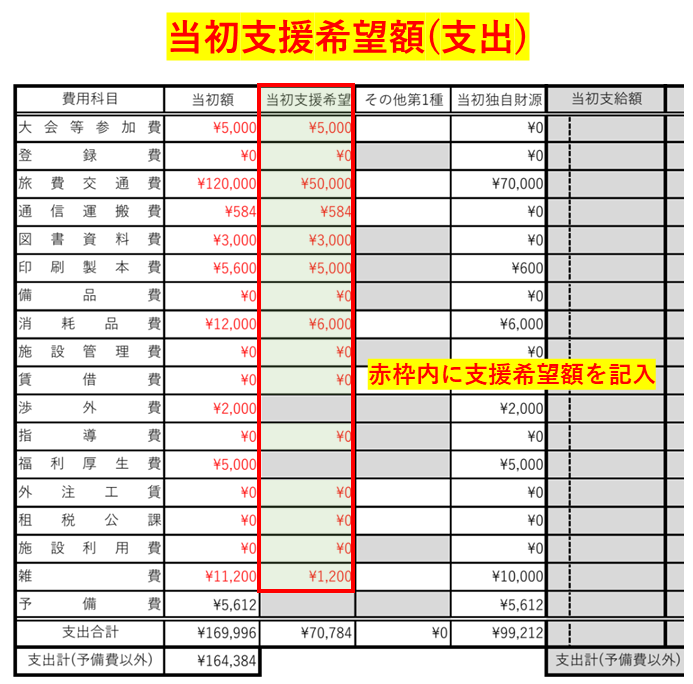
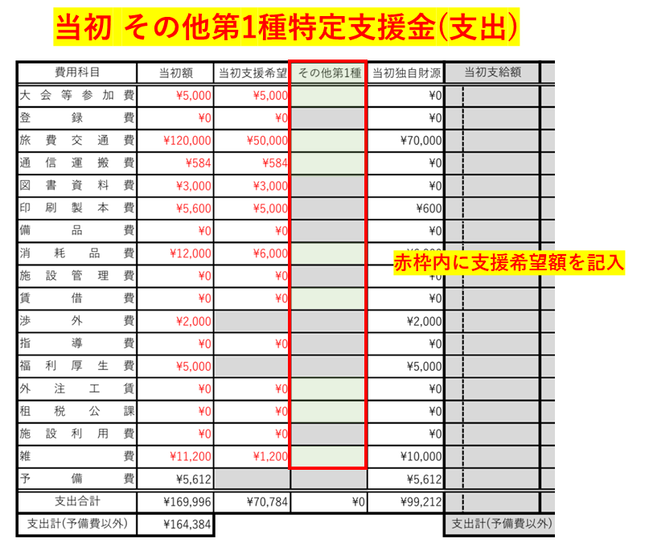

[書類の説明に戻る](./書類の説明.md)
# 年間収支額及び支援希望額表(様式2) 説明

## この書類は？
申請する活動予算と活動支援金の金額を勘定科目ごとに分けて記入します。  
当初の全体収支額・支援希望額を表に纏めます。

## 提出

- **様式**  
[年間収支額及び支援希望額表-テンプレート.xlsx]()(ダウンロードリンク)  
一部保護をかけています。保護箇所は記入不要な部分になっています。

- **提出条件**  
提出必須  

- **ファイルの種類**  
xlsx(Excelファイル)  

- **ファイル名**  
年間収支額及び支援希望額表-<ins>団体名</ins>.xlsx  
団体名の部分を編集してください。  
(例: 年間収支額及び支援希望額表-福工大研究会.xlsx)  

## 記入例
[こちら](./sample/年間収支額及び支援希望額表-記入例.pdf)から参照できます。赤字部分が記入箇所です。  
以下の説明と同時に閲覧することをおすすめします。

## 記入項目
7つのブロックに分かれています。
- [基本情報](#基本情報)
- [当初額](#当初額)
- [当初支援希望額](#当初支援希望額)
- [当初その他第1種特定支援金](#当初-その他第1種特定支援金)
    - [当初独自財源](#当初独自財源)(自動計算欄)
- [当初支給額](#当初支給額)(記入不要)
- [補正額](#補正額)(記入不要)
- [補正支援希望](#補正支援希望)(記入不要)
- [摘要](#摘要)

*****

### 団体情報
3つの記入項目があります。

1. **団体名**  
団体の名称を記入します。正式名称で記入してください。

2. **年度**  
申請をする年度を記入します。
<string><ins>和暦</ins></string>で記入してください。  

3. **申請区分**  
申請する区分を記入します。**当初を選択してください。** クリックするとプルダウンメニューが表示されますので、該当する項目を選択してください。 

*****

### 当初額
- **収益(収入)**  
    令和6年度の収入を、科目ごとに分けて、<ins>「年間収支及び支援希望額表」の当初額の収益の欄</ins>に記入します。  
    第1種特定支援金は当初支援希望額から自動で計算されます。  
    科目は、「受取第1種特定支援金」、「第2種特定支援金」、「受取定期活動徴収金」、「受取臨時活動徴収金」、「前年度繰越金」、「受取利息」、「受取寄付金」、「受取活動売上」、「雑収入」の9つです。科目の説明は[こちら](./勘定科目表.md)から確認してください。  
      

- **費用(支出)**  
    令和6年度の支出の合計額を、科目ごとに分けて、<ins>「年間収支及び支援希望額表」の当初額の費用の欄</ins>に記入します。   
    科目とその説明は、[こちら](./勘定科目表.md)から確認してください。
    「予備費」は総収入と総支出の差で、自動計算されます。  
    「予備費」がマイナス(赤字)の場合は申請できません。支出を見直してください。   
    

*****

### 当初支援希望額
- **費用(支出)**  
    令和6年度の**支援希望額**を、科目ごとに分けて、<ins>「年間収支及び支援希望額表」の当初支援希望額の欄</ins>に記入します。グレー背景の部分は記入できません。  
    

*****

### 当初 その他第1種特定支援金
- **費用(支出)**  
    令和6年度の**活動支援金の他に第1種特定支援金で受ける支援金額**を、科目ごとに分けて、<ins>「年間収支及び支援希望額表」の当初支援希望額の欄</ins>に記入します。グレー背景の部分は記入できません。  
    活動支援金の他に第1種特定支援金で受ける支援金には、「特別活動支援金」があります。
    
*****

### 当初独自財源(記入不要)
**このブロックは自動計算されます。** 記入が必要な欄はありません。

- **収益(収入)**  
当初額のうち、独自財源の収入の金額です。

- **費用(支出)**  
当初額のうち、独自財源で支出する金額です。

*****

### 当初支給額(記入不要)
- **収益(収入)**  
×記入しません。空白のままにしてください。

- **費用(支出)**  
×記入しません。空白のままにしてください。

*****

### 補正額(記入不要)
- **収益(収入)**  
×記入しません。空白のままにしてください。

- **費用(支出)**  
×記入しません。空白のままにしてください。

*****

### 補正支援希望(記入不要)
- **費用(支出)**  
×記入しません。空白のままにしてください。
*****

### 摘要
それぞれの科目ごとに、どういう使途なのかを簡潔に記述してください。

*****

## 戻る
[上に戻る](#年間収支額及び支援希望額表様式2-説明)  
[書類の説明に戻る](./書類の説明.md)  