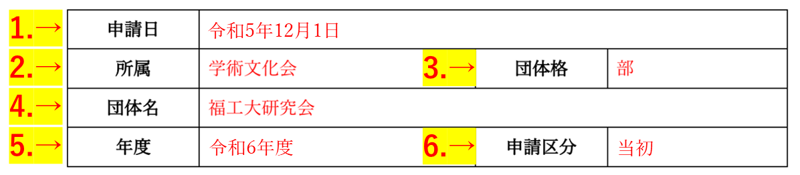
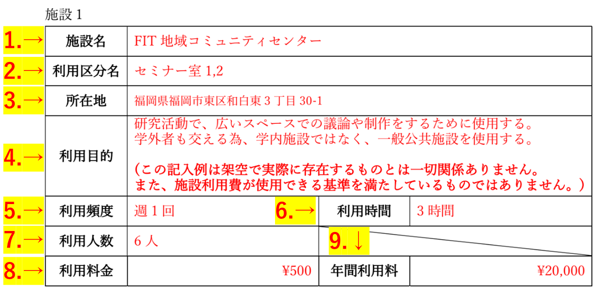
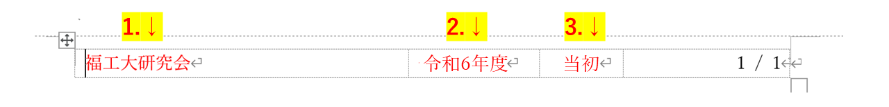

[書類の説明に戻る](./書類の説明.md)
# 施設利用費明細書(様式4) 説明

## この書類は？
施設利用費を計上する場合に、施設名や利用頻度、利用料金等の明細を記入します。

## 提出

- **様式**  
[施設利用費明細書-テンプレート.docx](https://github.com/fit-sogokanri/documents/raw/main/budget-and-grant/inital/distribution/%E6%96%BD%E8%A8%AD%E5%88%A9%E7%94%A8%E8%B2%BB%E6%98%8E%E7%B4%B0%E6%9B%B8-%E3%83%86%E3%83%B3%E3%83%97%E3%83%AC%E3%83%BC%E3%83%88.docx)(ダウンロードリンク)  

- **提出条件**  
施設利用費を計上している場合   

- **ファイルの種類**  
docx(Wordファイル)  

- **ファイル名**  
施設利用費明細書-<ins>団体名</ins>.docx  
団体名の部分を編集してください。  
(例: 施設利用費明細書-福工大研究会.docx)  

## 記入例
[こちら](./sample/施設利用費明細書-記入例.pdf)から参照できます。赤字部分が記入箇所です。  
以下の説明と同時に閲覧することをおすすめします。

## 記入項目
3つのブロックに分かれています。
- [基本情報](#基本情報)
- [施設利用情報](#施設利用情報)
- [フッター](#フッター)

*****

### 基本情報
6つの記入項目があります。

1. **申請日**  
申請をする日付を記入します。クリックするとカレンダーが表示されるので、日付を選択してください。

2. **所属**  
「体育会」か「学術文化会」のいずれか所属している方を選びます。クリックするとプルダウンメニューが表示されますので、該当する項目を選択してください。

3. **団体格**  
団体の格を記入します。クリックするとプルダウンメニューが表示されますので、該当する項目を選択してください。

4. **団体名**  
団体の名称を記入します。正式名称で記入してください。

5. **年度**  
申請をする年度を記入します。
<string><ins>和暦</ins></string>で記入してください。  

6. **申請種別**  
申請する期間区分を記入します。**当初を選択してください。** クリックするとプルダウンメニューが表示されますので、該当する項目を選択してください。 

*****

### 施設利用情報
記入項目は9つあります。

1. **施設名**  
使用する施設の名称を記入します。施設内にある部屋や区画の名前は、2.利用区分名に記入します。

2. **利用区分名**  
施設内で使用する設備(部屋や区画の名前)の名称を記入します。

3. **所在地**  
使用する施設の所在地(住所)を記入します。番地等まで書くこと。

4. **利用目的**  
その施設を利用する目的を記入します。  
学内施設の有無や、なぜ学外の施設なのかまで言及して記入してください。

5. **利用頻度** 
どの程度の頻度で利用するのか記入してください。

6. **利用時間**  
その施設を使用する時間を記入してください。

7. **利用人数**  
その施設を利用する団体所属の人数(利用する部員数)を記入してください。

8. **利用料金**  
1回あたりにかかる利用料金を記入してください。

9. **年間利用料**  
年間この施設を利用した場合の利用料金を記入してください。
利用料金と1年間の使用回数でおよそ算出できると思います。

**注意点**
- **根拠となる資料も作成してください。**  
この出金となる根拠の資料を作成し、追加資料として提出してください。
- **使途別金額明細書にも記入が必要です**  
- 記入欄が不足した時は自分でコピーしてください。

*****

### フッター
3つの記入項目があります。編集は、フッター上でダブルクリックするとできるようになります。
1. **団体名**  
団体の名称を記入します。正式名称で記入してください。

2. **年度**  
申請をする年度を記入します。**<ins>和暦</ins>**で記入してください。  

3. **申請区分**  
申請する区分を記入します。**当初を選択してください。** クリックするとプルダウンメニューが表示されますので、該当する項目を選択してください。 

## 戻る
[上に戻る](#施設利用費明細書様式4-説明)  
[書類の説明に戻る](./書類の説明.md)  