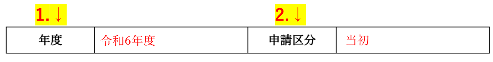
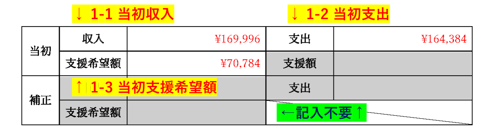
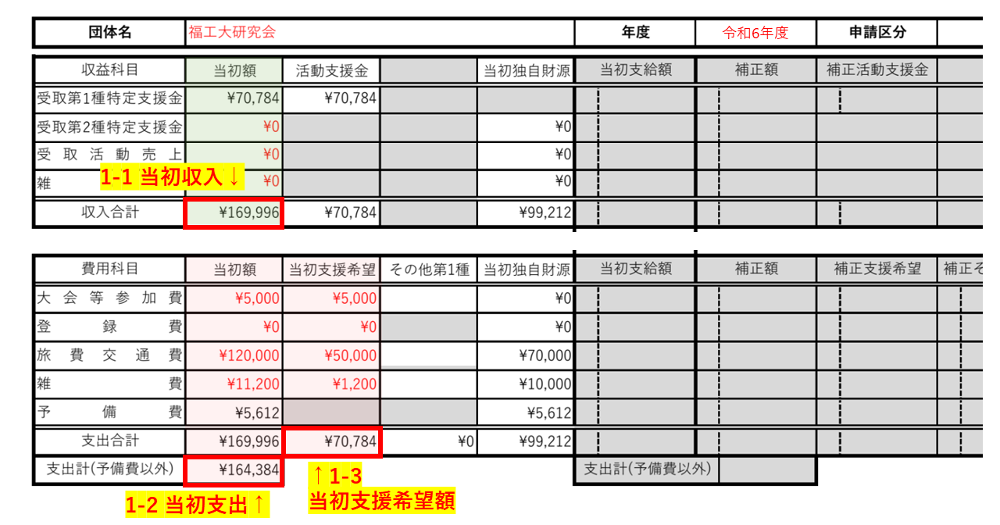

[書類の説明に戻る](./書類の説明.md)
# 活動予算書及び活動支援金申請書(様式1) 説明

## この書類は？
団体の基本情報や申請の概要を記入する書類です。

## 提出

- **様式**  
[活動予算書及び活動支援金申請書-テンプレート.docx]()(ダウンロードリンク)  

- **提出条件**  
提出必須  

- **ファイルの種類**  
docx(wordファイル)  

- **ファイル名**  
活動予算書及び活動支援金申請書-<ins>団体名</ins>.docx  
団体名の部分を編集してください。  
(例: 活動予算書及び活動支援金申請書-福工大研究会.docx)  

## 記入例
[こちら](./sample/活動予算書及び活動支援金申請書-記入例.pdf)から参照できます。赤字部分が記入箇所です。  
以下の説明と同時に閲覧することをおすすめします。

## 記入項目
4つのブロックに分かれています。
- [団体情報](#団体情報)
- [申請区分](#申請区分)
- [予算](#予算)
- [申請理由](#申請理由)

*****

### 団体情報
６つの記入項目があります。

1. **申請日**  
申請をする日付を記入します。クリックするとカレンダーが表示されるので、日付を選択してください。

2. **所属**  
「体育会」か「学術文化会」のいずれか所属している方を選びます。クリックするとプルダウンメニューが表示されますので、該当する項目を選択してください。

3. **団体格**  
団体の格を記入します。クリックするとプルダウンメニューが表示されますので、該当する項目を選択してください。

4. **団体名**  
団体の名称を記入します。正式名称で記入してください。

5. **代表者**  
会計統括責任者(代表者)の 氏名 と 学籍番号 を記入します。

6. **会計長**  
会計責任者(会計長)の 氏名 と 学籍番号 を記入します。

*****

### 申請区分
2つの記入項目があります。

1. **年度**  
申請をする年度を記入します。**<ins>和暦</ins>で記入してください。**

2. **申請区分**  
申請する区分を記入します。**当初を選択してください。** クリックするとプルダウンメニューが表示されますので、該当する項目を選択してください。  
 

[tip]申請区分とは  
活動予算書及び活動支援金申請には1年間に3種類の申請種別があります。  
<strong>「当初」</strong>とは、年度初め(正確には年度が始まる前)に行う申請のです。字の通り、年度初めに策定した予算書や活動支援金申請を指します。  
一方<strong>「補正」</strong>とは、年度内で当初の申請内容から変更を行う申請の事です。当初の申請から増減額が必要な場合に行います。  
その他に「追加」があります。

*****

### 予算
3つの記入項目があります。
1. **当初**  
当初申請の内容をそれぞれ記入します。  
    1. **収入**  
    「年間収支額及び支援希望額表」の<ins>収益</ins>(収益科目 上のグループ)の<ins>当初額</ins>の<ins>収入合計</ins>の欄の金額を記入してください。

    2. **支出**  
    「年間収支額及び支援希望額表」の<ins>費用</ins>(費用科目 下のグループ)の<ins>当初額</ins>の<ins>支出計(予備費以外)</ins>の欄の金額を記入してください。

    3. **支援希望額**  
    「年間収支額及び支援希望額表」の<ins>費用</ins>(費用科目 下のグループ)の<ins>当初支援希望</ins>の<ins>支出合計</ins>の欄の金額を記入してください。

    4. **支援額**  
    ×記入しません。空白のままにしてください。

2. **補正**  
    記入項目はありません。
    1. **収入**  
    ×記入しません。空白のままにしてください。

    2. **支出**  
    ×記入しません。空白のままにしてください。

    3. **支援希望額**  
    ×記入しません。空白のままにしてください。

年間収支額及び支援希望額表との対応

*****

### 申請理由
当初申請を行う理由を記入します。  
活動支援金の申請を行う場合は、その理由も含めて記入してください。

## 戻る
[上に戻る](#活動予算書及び活動支援金申請書様式1-説明)  
[書類の説明に戻る](./書類の説明.md)  